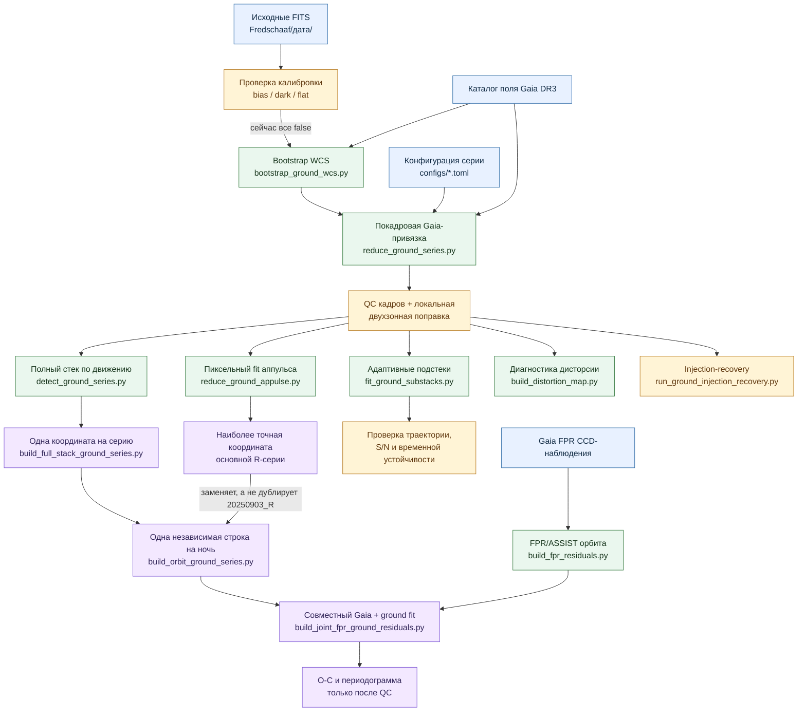

# Астрометрия астероида (7065) Fredschaaf

Учебно-исследовательский проект по обработке CCD-наблюдений слабого астероида:
привязка к Gaia DR3, локальная двухзонная коррекция, сложение кадров
по движению объекта и измерение центра эмпирической звёздной PSF.

## Содержимое репозитория

- `Fredschaaf/` — исходные FITS-кадры по датам наблюдений;
- `exam/` — исходный учебный пример астрометрической калибровки;
- `reductions.ipynb` — простая Gaia-привязка одного кадра;
- `series_reduction.ipynb` — промежуточная локальная редукция всей серии;
- `two_zone_stacking.ipynb` — короткий отчёт: диагностика, стеки и PSF поверх
  общего пакетного конвейера;
- `psf_simple_examples.ipynb` — наглядное введение в PSF на синтетических данных;
- `papers/` — статьи по астрометрии и поиску сигнала двойного астероида;
- `fredschaaf_astrometry/` — общие функции для Gaia FPR, наземных серий и
  ковариационно-взвешенной периодограммы;
- `fredschaaf_astrometry/ground.py` — тестируемые измерительные примитивы:
  FITS/время, Gaia на эпоху, касательная плоскость, аффинный fit и PSF;
- `scripts/download_gaia_fpr.py` — воспроизводимая загрузка FPR и расчёт
  ошибок CCD/транзитов;
- `configs/20250903_R.toml` — входы, параметры редукции и критерии качества
  конкретной наблюдательной серии;
- `configs/20250903_H_alpha.toml` — независимый перенос той же схемы на
  узкополосную Hα-серию без подбора параметров по результату;
- `configs/20250902_R.toml` — отдельная конфигурация короткой контрольной ночи;
- `configs/20251010_R.toml` — detection-only конфигурация десяти коротких
  R-кадров нового звёздного поля;
- `scripts/bootstrap_ground_wcs.py` — перенос геометрии WCS с перекрывающегося
  решённого поля по корреляции звёздного рисунка;
- `scripts/reduce_ground_series.py` — полный пакетный цикл от WCS-FITS до
  покадрового контроля, стеков, PSF и итоговой координаты;
- `scripts/reduce_ground_appulse.py` — совместная пиксельная подгонка траектории
  астероида относительно близкой Gaia-звезды по всем пригодным кадрам;
- `scripts/detect_ground_series.py` — единый motion-compensated стек всей серии
  и matched-PSF detection со split-half проверкой;
- `scripts/fit_ground_substacks.py` — адаптивные последовательные подстеки,
  forced photometry и линейная траектория с полной ковариацией;
- `scripts/plot_ground_substacks.py` — графики координат, линейного fit и S/N
  подстеков;
- `scripts/build_full_stack_ground_series.py` — одна астрометрическая строка на
  обнаруженную серию с ковариацией, расширенной по odd/even расхождению;
- `scripts/run_ground_injection_recovery.py` — искусственные движущиеся источники
  той же яркости в реальных кадрах, повторный стек и проверка ошибок/полноты;
- `scripts/diagnose_ground_snr.py` — воспроизводимая таблица фона, временного
  пиксельного шума, ширины PSF и эквивалентного покадрового S/N;
- `scripts/build_ground_series.py` — полная ковариация и контроль качества
  результата наземной серии в общей табличной схеме;
- `scripts/build_joint_fpr_ground_residuals.py` — единый шестипараметрический
  орбитальный fit Gaia FPR и прошедших QC наземных положений;
- `RESULTS_FOR_SUPERVISOR_RU.md` — короткий отчёт для научного руководителя:
  методика, критерии включения, полученные числа и ограничения;
- `PROJECT_PLAN_RU.md` — результаты, ограничения и следующие этапы.

Производные таблицы и кэш сохраняются в `outputs/` и не входят в Git.

## Как устроен расчёт



Главный маршрут для новой ночи: создать TOML-конфигурацию → при необходимости
получить bootstrap WCS → выполнить `reduce_ground_series.py` → подтвердить
объект полным стеком и split-half проверкой → собрать одну координату серии.
Подстеки, аппульсный fit и карта дисторсии являются независимыми проверками и не
должны незаметно менять решение по включению серии. Hα сейчас заканчивается на
этапе проверки обнаружения и в орбитальный fit не попадает.

## Установка и запуск

```bash
python3 -m venv .venv
.venv/bin/python -m pip install -r requirements.txt
./run_jupyter.sh
```

Ноутбуки рассчитаны на последовательное выполнение сверху вниз из корня
репозитория.

Подготовка двух наборов данных и запуск проверок:

```bash
.venv/bin/python scripts/download_gaia_fpr.py --number 7065
.venv/bin/python scripts/download_gaia_field.py
.venv/bin/python scripts/bootstrap_ground_wcs.py
.venv/bin/python scripts/bootstrap_ground_wcs.py \
  --input-glob 'Fredschaaf/20251010/*.fits' \
  --reference Fredschaaf/20250903/7065_R_4_0001_wcs.fits \
  --catalog Fredschaaf/20251010/gaia_dr3_field_g19_5.csv --overwrite
.venv/bin/python scripts/reduce_ground_series.py
.venv/bin/python scripts/reduce_ground_series.py --config configs/20250903_H_alpha.toml
.venv/bin/python scripts/reduce_ground_series.py --config configs/20250902_R.toml
.venv/bin/python scripts/reduce_ground_series.py --config configs/20251010_R.toml
.venv/bin/python scripts/build_ground_series.py
.venv/bin/python scripts/build_ground_series.py --config configs/20250903_H_alpha.toml \
  --output outputs/ground_series_20250903_H_alpha.csv
.venv/bin/python scripts/build_ground_series.py --config configs/20250902_R.toml \
  --output outputs/ground_series_20250902_R.csv
.venv/bin/python scripts/build_ground_series.py --config configs/20251010_R.toml \
  --output outputs/ground_series_20251010_R.csv
.venv/bin/python scripts/reduce_ground_appulse.py --config configs/20250903_R.toml
.venv/bin/python scripts/detect_ground_series.py --config configs/20250902_R.toml
.venv/bin/python scripts/detect_ground_series.py --config configs/20250903_R.toml
.venv/bin/python scripts/detect_ground_series.py --config configs/20250903_H_alpha.toml
.venv/bin/python scripts/detect_ground_series.py --config configs/20251010_R.toml
.venv/bin/python scripts/fit_ground_substacks.py --config configs/20250903_R.toml
.venv/bin/python scripts/fit_ground_substacks.py --config configs/20250903_H_alpha.toml \
  --seed-offset-mas 34.82 23.32 --force-groups 4
.venv/bin/python scripts/run_ground_injection_recovery.py \
  --config configs/20250902_R.toml --expected-snrs 4 6 8 12 20 40
.venv/bin/python scripts/run_ground_injection_recovery.py \
  --config configs/20250903_R.toml --expected-snrs 4 6 8 12 20 40
.venv/bin/python scripts/run_ground_injection_recovery.py \
  --config configs/20251010_R.toml --expected-snrs 4 6 8 12 20 40
.venv/bin/python scripts/build_full_stack_ground_series.py
.venv/bin/python scripts/build_orbit_ground_series.py
.venv/bin/python scripts/build_fpr_residuals.py
.venv/bin/python scripts/build_ground_fpr_residual.py
.venv/bin/python scripts/build_joint_fpr_ground_residuals.py
.venv/bin/python scripts/build_fpr_periodogram.py
.venv/bin/python scripts/build_distortion_map.py
.venv/bin/python scripts/diagnose_ground_snr.py
.venv/bin/python -m unittest discover -s tests -v
```

В `outputs/gaia_fpr_7065_ccd.csv` сохраняются CCD-наблюдения с флагами и
проекциями ошибок AL/AC, а в `outputs/gaia_fpr_7065_transits.csv` — только
перенесённые на уровень транзита ковариации. Координаты внутри транзита намеренно
не усредняются: сначала орбитальная модель должна быть вычислена для эпохи
каждого CCD, и только её O−C можно объединять. Наземная строка сохраняется в
`outputs/ground_series.csv`. Совместный линейный fit парных ξ/η-положений стеков
восстанавливает полную ковариацию центральной координаты, включая взаимный член.
Параметры ноутбука и пороги качества читаются из того же TOML-конфига.

WCS для `20250902` является bootstrap-решением, а не независимым слепым plate
solve: геометрия камеры переносится с перекрывающегося решённого кадра
`20250903`, а сдвиг определяется корреляцией звёзд. Затем каждый кадр всё равно
получает новую локальную аффинную Gaia-привязку. Прежнее разбиение 19 принятых
кадров на шесть стеков по 2–4 кадра давало ложный отказ QC: использовался максимум
пикселя, а последний слабый двухкадровый стек разрушал линейный fit. Единый
motion-compensated стек уверенно обнаруживает объект с fitted S/N `29.89`.
Формальные ошибки `56/58 mas`; odd/even половины расходятся на `265 mas`, поэтому
после добавления половины этого вектора в ковариацию итоговые ошибки равны
`88/128 mas`. Серия включена в общую таблицу с малым статистическим весом.
Производные `_wcs.fits` игнорируются Git; их заголовки хранят ссылку на опорный
кадр, измеренный сдвиг и контраст корреляционного пика.

Hα-серия `20250903` также сложена целиком по движению: использованы 94 из 99
кадров. Во время серии расстояние до Gaia-звезды G≈14.65 уменьшается с `15.7″`
до `12.2″`, поэтому PSF-фит теперь ограничен локальной областью около астероида,
не включающей крыло звезды. Слепой поиск полного стека даёт формальные S/N `9.06`,
но в положении примерно на `0.45″` от прогноза R-серии; кандидат не повторяется
в четырёх последовательных подстеках. Signed forced photometry в ожидаемом
положении даёт лишь S/N `6.19` (по четвертям `5.55`, `3.82`, `3.35`, `1.38`).
Поэтому это полезное фотометрическое необнаружение, но не астрометрическая
координата. Главные причины — узкая полоса при тех же экспозициях `5 s` и
растущее загрязнение близкой звездой.

Для нового поля `20251010` первый WCS строится из геометрии той же камеры,
координат наведения FITS и отдельного Gaia-каталога; корреляция каталожного и
наблюдаемого звёздных рисунков уточняет сдвиг. Остальные девять кадров
привязываются цепочкой по перекрытию. Это bootstrap, а не независимый blind
solve. Причина прежнего провала найдена: использовались округлённое наведение,
нулевая скорость и поиск только в пределах ±5 px. FPR/ASSIST даёт скорость
`(−22.67, −15.20) arcsec/hour`; найденный объект находится в `5.7″` от
округлённого наведения и всего примерно в `0.3″` от FPR-прогноза, не совпадая с
Gaia-звёздами. Полный стек десяти кадров даёт fitted S/N `44.66`. Формальные
ошибки `38/30 mas`, odd/even расхождение `227 mas`; расширенные ошибки
`116/42 mas`. Серия включена в общий ряд с соответствующей ковариацией.

Основной продукт для межночного анализа теперь
`outputs/ground_full_stack_series.csv`: три R-эпохи `20250902`, `20250903` и
`20251010`. В каждой строке одна координата на центральный момент серии.
Формальная ковариация matched-PSF fit дополняется внешним произведением половины
odd/even-разности. Это сохраняет полезные слабые серии, но не даёт им завышенного
веса.

Для орбитальной подгонки используется производная таблица
`outputs/ground_orbit_series.csv`. В ней полный стек `20250903_R` заменён более
осторожным аппульсным forward fit с добавкой за выбор PSF; две оценки одних и
тех же 92 кадров не считаются независимыми и одновременно в fit не попадают.
Для остальных ночей остаются full-stack измерения. Это гарантирует правило
«одна серия — одна строка» и не даёт дважды учесть одни пиксели.
После совместного fit остатки трёх выбранных измерений равны соответственно
`(36.0,189.9)`, `(−24.5,45.8)` и `(216.6,195.0) mas` по ξ/η.

Injection-recovery выполнен непосредственно на принятых реальных кадрах. В
каждый кадр до интерполяции и sigma clipping добавляется эмпирическая PSF с
потоком обнаруженного астероида и постоянным смещением относительно той же
линейной траектории. Для восьми положений вокруг объекта во всех трёх R-сериях
полнота равна `100%`. RMS ошибки восстановления равен `77/88 mas` для
`20250902_R`, `19/22 mas` для `20250903_R` и `90/35 mas` для `20251010_R`.
Медианное восстановление потока составляет соответственно `0.950`, `0.963` и
`0.987`. Для слабых ночей эти числа подтверждают масштаб odd/even-добавки; для
лучшей ночи одна из восьми инъекций выходит за формальную 95%-эллипсу, поэтому в
орбитальном fit сохраняется более осторожная аппульсная ковариация.

Дополнительно построена кривая полноты на расчётных уровнях S/N
`4, 6, 8, 12, 20, 40`; реальный поток астероида всегда добавляется в сетку
отдельно. При расчётном S/N `8` прошли критерий обнаружения `0/8` инъекций для
`20250903_R` и по `1/8` для двух коротких серий. При расчётном S/N `12`
получено `7/8`, `8/8` и `8/8`. Причина — после внесения в отдельные кадры,
интерполяции и clipping фактический fitted S/N ниже простого линейного прогноза.
Поэтому `fitted S/N >= 8` остаётся критерием на уже измеренном стеке, но заранее
планировать почти полное обнаружение следует ближе к ожидаемому S/N около 12.
При восьми положениях нижняя 95%-граница Wilson даже для `8/8` равна лишь
`0.676`; это пока калибровочная диагностика, а не точная функция полноты.

Полные результаты сохраняются в `injection_recovery_<series>.csv`, агрегаты —
в одноимённых `_summary.csv` и `_summary.json`, а график полноты, позиционного
RMS и восстановления потока — в `.png` внутри `outputs/`.

### Калибровка исходных кадров

Независимых bias, dark и flat для этих серий нет, и конвейер их не имитирует:
во всех конфигурациях это явно записано как `bias = false`, `dark = false`,
`flat = false`. Из почти недизерингованных научных кадров нельзя строить и
применять «superflat»: в нём смешались бы чувствительность камеры, градиент неба
и неподвижные звёзды.

Для текущей **дифференциальной астрометрии** обработка остаётся пригодной, но с
оговорками. Фон оценивается локально вокруг цели, выбросы подавляются clipping,
а результат проверяется разделением серии и искусственными источниками.
Автоматическая диагностика показывает устойчивый крупномасштабный рисунок фона
с RMS примерно `4.0%`, `3.9%`, `5.1%` и `1.2%` по четырём сериям; сюда входят и
flat-field, и градиент неба, разделить их без калибровочных данных нельзя. При
этом замена постоянного локального фона линейной плоскостью меняет RMS в кольце
астероида менее чем на `1%`. Следовательно, именно локальный градиент сейчас не
объясняет низкий S/N.

Это не делает кадры фотометрически калиброванными. Текущие потоки годятся для
относительного S/N и injection-recovery внутри той же серии, но не для
абсолютной фотометрии; отсутствие flat/dark/bias остаётся систематическим
ограничением для точности существенно лучше нынешних `30–100 mas`. Скрипт
`diagnose_ground_snr.py` сохраняет флаги калибровки, стабильность блочного фона,
локальный градиент, долю насыщенных пикселей и шум в
`outputs/ground_snr_budget.csv`.

### Почему S/N получается таким

Для основной R-серии медианный покадровый fitted S/N аппульсного fit равен
`6.84`; объединение 92 кадров даёт `68.4`, практически ожидаемые
`6.84·sqrt(92) = 65.6`. Значит, сложение работает, а ограничение возникает уже
в одном пятисекундном кадре. В нём временной шум фона составляет около
`461 ADU/pixel`, а звёздная PSF имеет FWHM `5.57 px` (`2.72″`) и гауссову
шумовую площадь около `70 px²`. При потоке порядка `32167 ADU` простая оценка
matched filter даёт S/N около `80` на всю серию, согласуясь по масштабу с
покадровым forward fit (`68`) и формальным fit стека (`96`). Разница между ними
показывает влияние коррелированных после интерполяции пикселей и выбора модели
PSF; значение `96` нельзя считать внешней точностью.

В Hα forced-поток в ожидаемой позиции всего `1984 ADU`, то есть примерно в
16 раз меньше R-потока, а PSF шире (`7.67 px`, шумовая площадь около `133 px²`).
Более низкий пиксельный шум Hα (`335 ADU`) лишь частично это компенсирует:
простая оценка даёт S/N `4.96`, измеренная signed forced photometry — `6.19`.
Слепой положительный поиск выбирает другой пик с S/N `9.06`; он теперь явно
помечается только как `blind_candidate_ok`, тогда как итоговый `detection_ok`
для Hα равен `False` по независимой позиции R-серии.

Все экспозиции имеют длительность `5 s`. При скорости сентябрьской серии около
`11″/hour` даже за `30 s` смаз составил бы лишь `0.09″`, намного меньше seeing
`2.72″`. Поэтому следующий наблюдательный тест должен сравнить 5, 15 и 30 секунд
при одинаковом общем времени, контролируя насыщение опорных звёзд. В режиме,
где заметен шум считывания/усиления, более длинные экспозиции дадут больший S/N,
чем дальнейшее дробление той же интеграции. Значение FITS `GAIN=1000` здесь
трактуется только как настройка камеры, а не как известный коэффициент e⁻/ADU.

Адаптивное деление сохраняется в `outputs/adaptive_substacks_*.csv`. Для
`20250903_R` получено 12 последовательных подстеков по 7–8 кадров с S/N
`20.5–33.2`; все прошли обнаружение. Линейный fit даёт на центральный момент
`(34.3,29.9) mas`, согласуясь с полным стеком `(34.8,23.3) mas`. Разброс выше
формального (`reduced chi²=3.64`), поэтому ошибки, масштабированные по разбросу,
равны `27/31 mas`. Поправка скорости `(255,−143) mas/hour` после того же
масштабирования незначима. Для `20250902_R` три подстека раннего непрерывного
отрезка обнаружены, но расходятся сильнее ошибок; два кадра после 18-минутного
перерыва дают S/N `4.03` и в траекторию не входят. Для `20251010_R` все три
подстека обнаружены, но база `1.46 min` принципиально недостаточна для измерения
скорости.

Для основной R-серии дополнительно выполнен прямой forward fit пикселей всех 92
принятых кадров в окрестности аппульса. Общими параметрами являются положение и
скорость астероида, а фон и поток независимо профилируются на каждом кадре.
Основная Gaia-звезда находится в `18.65″` от астероида. На центральный момент
`2025-09-03 21:21:26.053 UTC` с покадровой PSF получено
`O−C = (−22.62, +29.99) mas` относительно линейной исходной эфемериды;
формальные ошибки равны `27.3` и `30.9 mas`. Совокупный fitted S/N равен `68.4`,
ни один кадр не упёрся в границу поиска. Повтор относительно второй близкой
звезды изменяет положение на `26.41 mas`, а leave-one-group-out разброс
составляет `20.0/8.6 mas` по ξ/η.

Для каждого из 92 кадров PSF построена независимо по 23–24 звёздам; групповая
PSF сохранена как контроль. Два метода различаются на `31.98 mas` по положению,
поэтому этот вектор добавляется внешним произведением к формальной ковариации.
Итоговые ошибки для орбитального fit равны `35.7/38.1 mas`, корреляция ξ/η
равна `−0.416`. Выбор PSF теперь не скрыт внутри формальной ошибки.

Медианный FWHM покадровой PSF равен `5.57 px`, диапазон по серии — `0.88 px`.
Корреляции локального остатка с FWHM и RMS внешней покадровой привязки малы
(`|r| < 0.11`). Это означает только отсутствие обнаруженной зависимости при
шуме одиночного центра `270–360 mas`, а не отсутствие seeing-систематики.
Воздушная масса меняется с `1.183` до `1.221`, но `tan(z)` почти полностью
вырожден с временем (`r = −0.99955`), поэтому DCR-коэффициент по этой серии не
оценивается и атмосферная поправка к координате не применяется.

Это сильная внутренняя проверка обнаружения, но не доказательство абсолютной
точности в несколько mas: лучший/медианный 2D RMS псевдоастероидов по полевым
звёздам составляет `113/179 mas` для основной и `184/221 mas` для контрольной
опорной звезды, а текущий перенос
Gaia не включает параллакс и перспективное ускорение. Поэтому в совместный fit
передаётся полная ковариация с добавкой за выбор PSF, а диагностические таблицы
`appulse_frames_*`, `appulse_jackknife_*`, `appulse_pseudo_stars_*`,
`appulse_systematics_*` и `appulse_psf_comparison_*` должны проверяться вместе с
итоговой строкой.

Совместный fit 74 Gaia-транзитов и аппульсного положения практически не меняет
FPR-состояние: ожидаемая ошибка орбиты на наземной эпохе (`1.35/0.29 mas`)
намного меньше ошибки наземного измерения. После совместной подгонки наземный
остаток равен примерно `(−24.5, +45.8) mas`; это согласование одной эпохи, а не поиск
периодического сигнала.

Пакетный скрипт и основной ноутбук экспортируют покадровые звёздные O−C в
`outputs/two_zone_distortion_samples_20250903_R.csv`. Скрипт карты сначала
усредняет измерения каждой Gaia-звезды, требует несколько независимых звёзд и
кадров в ячейке, затем удаляет вырожденные с покадровой моделью аффинные моды.
Каждый пятый целый кадр откладывается для диагностической проверки. При почти
неизменном наведении такая проверка ещё не отделяет ошибку каталога от
дисторсии — для этого понадобятся серии с дизерингом либо отдельное
калибровочное поле.
Расширенный каталог содержит 680 Gaia-источников до `G=19.5`, но на коротких
пятисекундных кадрах устойчиво центроидируются только 57. Поэтому текущая сетка
по умолчанию всего `4 × 3`; более мелкая разбивка создаёт ячейки, определяемые
одной-двумя звёздами, и статистически не оправдана.

FPR-вектор распространяется с ASSIST и JPL DE440/DE441 с учётом опубликованных
переходов масштаба FPR → TCB → TDB, положения Gaia и времени распространения
света. Малое шестипараметрическое уточнение согласует опубликованную орбиту с
силовой моделью ASSIST. Для наземной точки используется положение станции MPC
217 (Assy-Turgen); в проекте она называется пулковской по принадлежности данных,
но это не площадка Главной Пулковской обсерватории с кодом 084.

Функция `scan_vector_periods` принимает одномерные проекции общего двумерного
сигнала. Поэтому в одну задачу можно включить Gaia AL с направлением скана и
пулковские ξ/η с их ковариациями. Получаемая `power` является диагностикой;
значимость будущего пика нужно оценивать по реальным эпохам с помощью
инъекций и блочного bootstrap по ночам.

## Рекомендуемый порядок знакомства

1. `psf_simple_examples.ipynb` — что такое PSF, как она получается из звёзд и
   применяется к слабому астероиду.
2. `reductions.ipynb` — координаты Gaia на эпоху наблюдений, центры звёзд и
   линейная модель `x, y → ξ, η`.
3. `series_reduction.ipynb` — исходный вариант локальной редукции и стеки по
   10 кадров.
4. `two_zone_stacking.ipynb` — текущий основной результат.

## Основной метод

В `two_zone_stacking.ipynb` реализована локальная двухзонная схема:

1. Звёзды внутри 4 угловых минут от астероида являются контрольными.
2. Звёзды в кольце 4–10 минут задают внешнюю линейную привязку к Gaia DR3.
3. Среднее `O−C = измеренное − Gaia` внутренних звёзд используется как
   локальная поправка кадра.
4. Кадры с плохой внешней моделью исключаются по критерию
   `median(RMS) + 3 × robust_sigma`; отбор не использует положение астероида.
5. Оставшиеся кадры складываются пятью независимыми группами примерно по
   20 исходных экспозиций с компенсацией движения астероида (`shift-and-add`).
6. Для каждой группы по сотням несатурированных звёзд строится эмпирическая PSF.
7. Центр астероида измеряется сдвигом фиксированной PSF; для контроля выполняется
   параллельная подгонка свободной двумерной гауссианы.

Внутренняя граница 4 минуты выбрана после проверки радиусов 3–5 минут. Она даёт
11 контрольных звёзд вместо четырёх при исходной границе 3 минуты. Группы
контрольных звёзд и внешних калибраторов остаются непересекающимися.

## Текущий результат для 2025-09-03, фильтр R

- обработано 98 исходных кадров, 6 кадров исключены по внешней звёздной модели;
- медианный RMS внешней Gaia-модели: `123.7 mas`;
- в пяти стеках осталось 16–20 хороших кадров;
- медианное отношение сигнал/шум стека: `12.94`;
- двумерный RMS свободной гауссианы: `51.2 mas`, с поправкой `n−2` — `66.1 mas`;
- двумерный RMS звёздной PSF: `46.9 mas`, с поправкой `n−2` — `60.5 mas`;
- центральный момент серии: `2025-09-03 21:21:55.329 UTC`;
- `RA = 43.48797876°`, `Dec = +15.44052461°`;
- внутренние ошибки центральной координаты: `22.6 mas` по ξ и `14.9 mas` по η;
- корреляция ошибок ξ/η: `0.310`; автоматические проверки качества пройдены.

Из-за всего пяти независимых стеков более осторожной оценкой считается RMS с
делителем `n−2`, то есть сейчас основной показатель равен примерно `60 mas`.

## Статьи

- `papers/S003809462470031X.pdf` — двухзонная редукция, локальные O−C и PSF;
- `papers/1-s2.0-S0032063321000842-main.pdf` — относительная астрометрия по Gaia;
- `papers/2406.07195v2.pdf` — поиск астрометрического сигнала двойного астероида.
